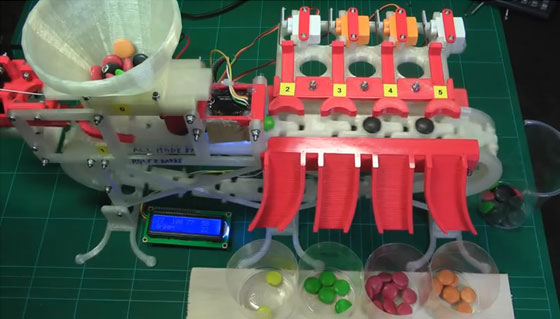

# Seminario

*Universidad Politécnica de Tulancingo*

-**Nombre:** Lizbeth Domínguez Domínguez 

-**Asesor:** Arturo Negrete Medellín 

## **Clasificador de objetos por color** :rainbow:
El proyecto consiste en el diseño y construcción de un sistema de clasificación de objetos según su color (azul, verde o rojo). 
El sistema consiste en un dispensador que contiene los objetos y los coloca en una banda transportadora que los lleva al sensor y posteriormente, según el color, los contenedores que estan al frente se mueven para que el objeto caiga en el correspondiente.

